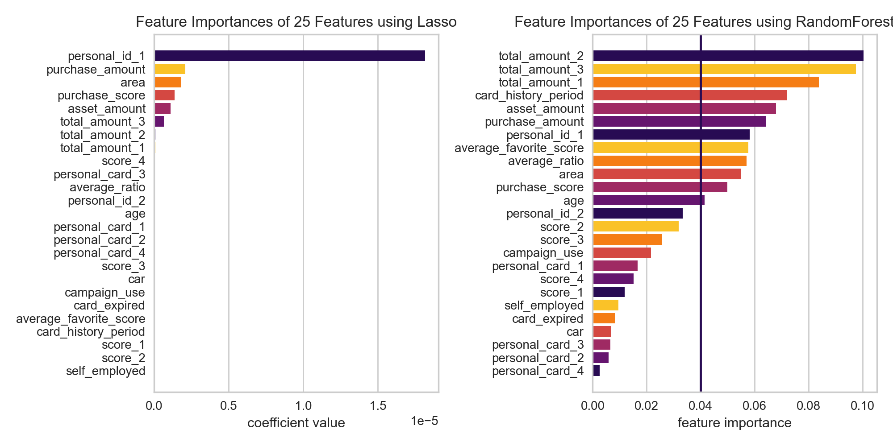
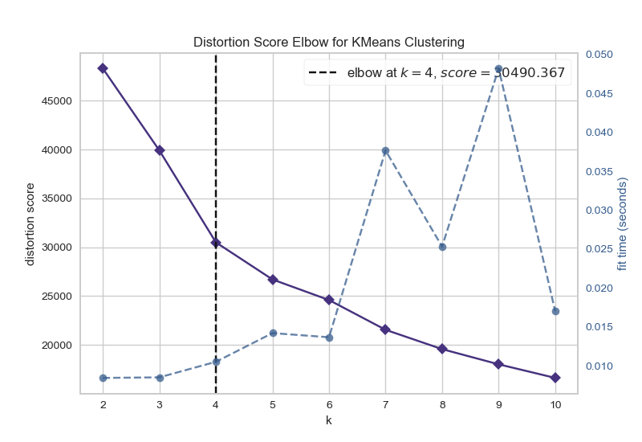
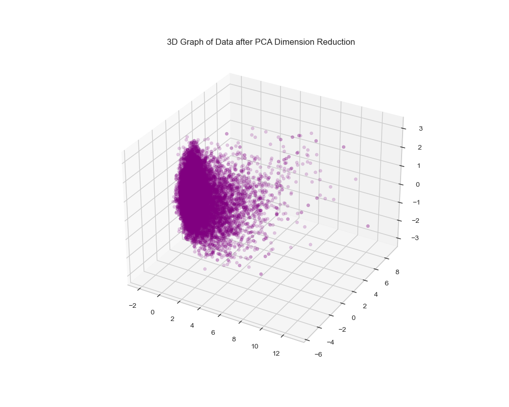
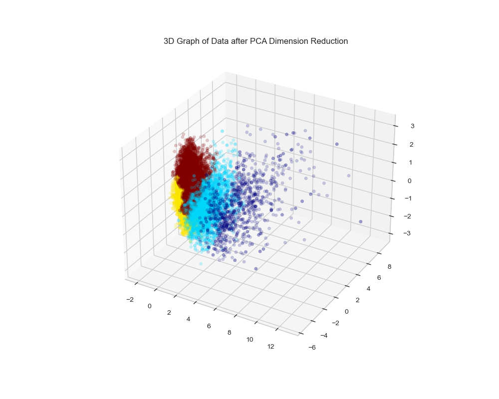
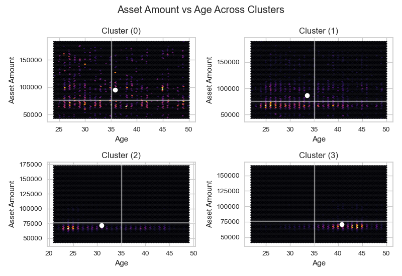
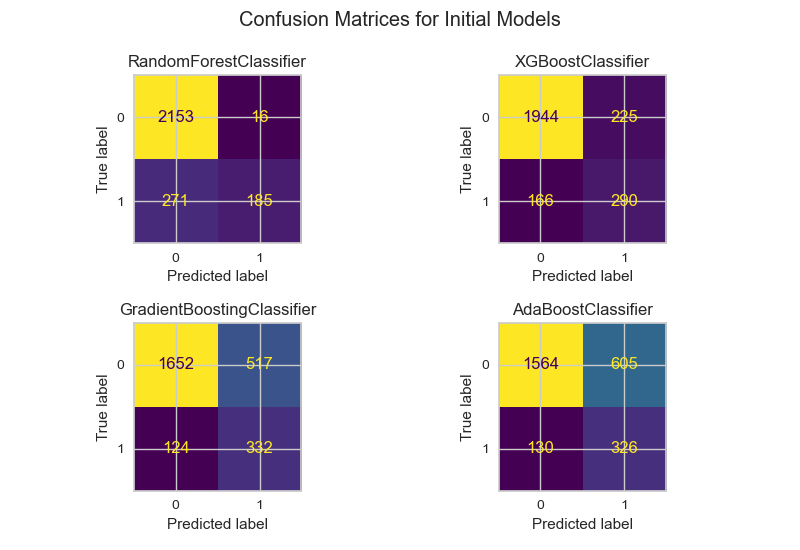
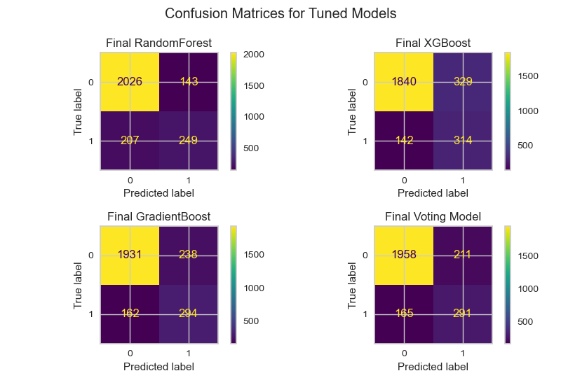

# Business Problem

The main objective was to create a model specifying the potential importance of the customer.  

I really wanted the model to have a high **recall** (don't miss the real important customers), but also keep quite good **precision** (don't take non-important customers as important ones).  

I have created 4 models, where one of them is the **Ensemble** of the rest.  

The data comes from one of the competitions from **kaggle**.

---

# Exploratory Data Analysis

The data was quite clean from the beggining, however there was quite a lot of missing data and lots of features. After a few quick insights, I performed a **Feature Selection** using both **Lasso** and **Random Forest** feature importances.  

I decided that the threshold will be 0.04 in terms of the **RF**.

---

# Dealing with missing data

I decided to use **MICE (Multivariate Imputation by Chained Equations)** imputation in order to deal with the missing data. This method seemed to be really adequate to the dataset, because after **Feature Selection**, there were only 2 columns with any missing data, so the models created via **MICE** were only for 2 of the features.  

---

# Clustering

Apart from the classification, I also wanted to check whether I can find any related groups in the customer data, so I performed a clustering via **Agglomerative Clustering Method**. However my first step was to **reduce the dimensions** using **PCA (Principal Components Analysis)** in order to visualize the data in 3D space.  

#### 1. First I found the most optimal number of clusters in the dataset via Elbow Method.

It turned out that there were 4 of them.

#### 2. Next I could visualize the clusters

|  |  |
| --- | --- |    
    

#### 3. Differences between groups
One major aspect that divided the clusters was the relation between **Age** and **Asset Amount**.  
*Where the lines show the global averages, and the points - cluster average.* 

We could find that:

- **Cluster No. 2** contains mostly **young** customers a little bit **below** the average asset amount
- **Cluster No. 3** is made of mostly **older** customers, also a little bit **under** the average asset line
- **Cluster No. 1** have the **varied age** customers, however more younger rather than older with a little bit **above** the average of asset line
- **Cluster No. 0** varies in both dimensions, however mostly contains **average-aged** customers with the **most** of the asset amount, also containing some outliers

However any of the clusters could not specify the importance of the customer.

---

# Models Creation

I initally tested 6 different models with default parameters, picking 4 best performing:

- **GradientBoosting**
- **XGBoost**
- **RandomForest**
- **AdaBoost**

However decided to hyperoptimize only first 3 of them.  

#### 1. Initial Results

- Random Forest had **too low recall** with **great precision**, but the recall was definitely too low.
- XGBoost was **pretty good initally**, however I wanted a little **higher recall** though.
- Gradient Boost had **really good recall**, unlucky paying the price with **low precision**.

So I wanted to find something between **Gradient Boost** and **XGBoost**.

#### 2. Results After Hyperoptimization

As I had too increase the **recall**, but also looking after **precision** not to raise too high, I tuned the models to balance both of these parameters, where these two were found to be the most optimal:

- Voting Classifier (which is ensembled on all of the 3), is the most balanced one, being a little improved version of the initial **XGBoost**.
- XGBoost presented **quite high recall**, having not that low precision.

However, if catching all of the important customers, regardless of the number of incorrect guesses, the **Initial Gradient Boost** would be the most beneficial, however it could also be optimized a little bit in this direction.

